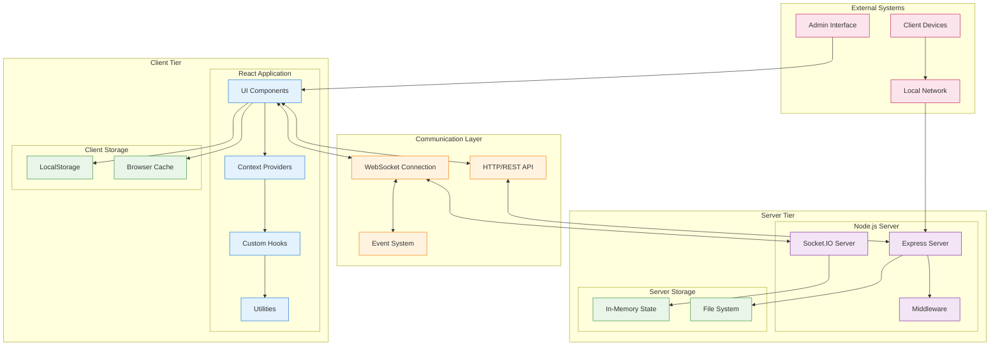
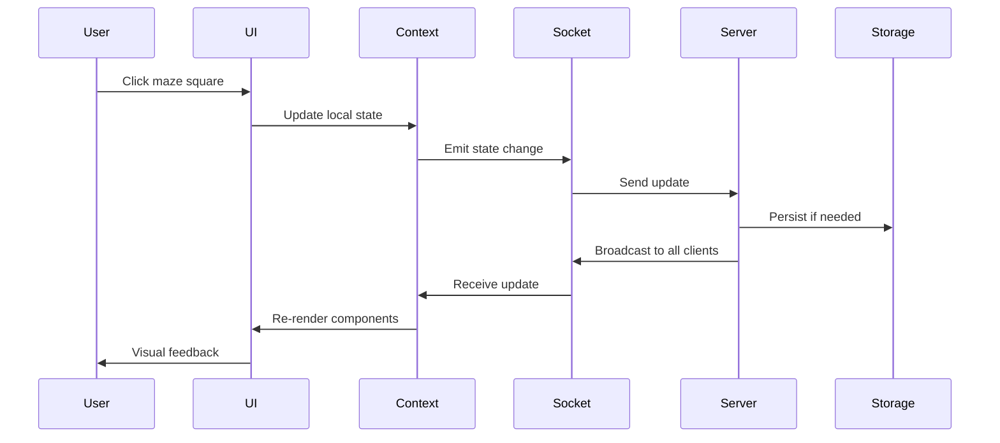
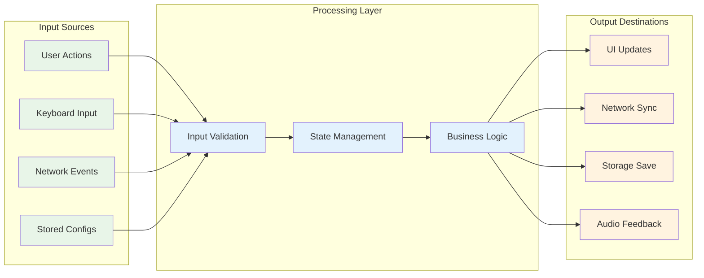
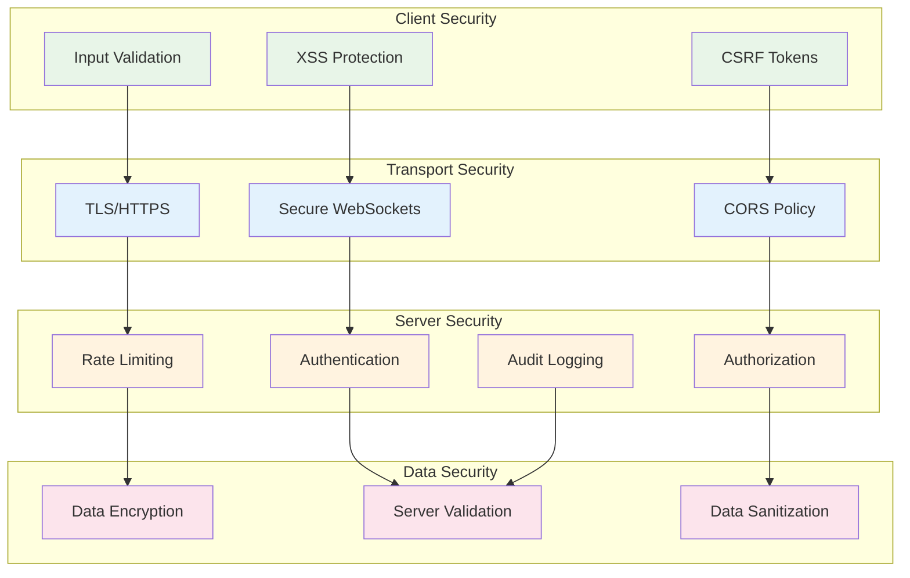

# Electric Maze - Architecture Diagrams

## System Architecture Overview

```mermaid
graph TB
    subgraph "Client Tier"
        subgraph "React Application"
            UI[UI Components]
            CTX[Context Providers]
            HOOKS[Custom Hooks]
            UTILS[Utilities]
        end
        
        subgraph "Client Storage"
            LS[LocalStorage]
            CACHE[Browser Cache]
        end
    end
    
    subgraph "Communication Layer"
        WS[WebSocket Connection]
        HTTP[HTTP/REST API]
        EVENTS[Event System]
    end
    
    subgraph "Server Tier"
        subgraph "Node.js Server"
            EXPRESS[Express Server]
            SOCKET[Socket.IO Server]
            MIDDLEWARE[Middleware]
        end
        
        subgraph "Server Storage"
            MEMORY[In-Memory State]
            FILES[File System]
        end
    end
    
    subgraph "External Systems"
        NETWORK[Local Network]
        DEVICES[Client Devices]
        ADMIN[Admin Interface]
    end
    
    %% Client connections
    UI --> CTX
    CTX --> HOOKS
    HOOKS --> UTILS
    UI --> LS
    UI --> CACHE
    
    %% Communication layer
    UI <--> WS
    UI <--> HTTP
    WS <--> EVENTS
    
    %% Server connections
    WS <--> SOCKET
    HTTP <--> EXPRESS
    EXPRESS --> MIDDLEWARE
    SOCKET --> MEMORY
    EXPRESS --> FILES
    
    %% External connections
    DEVICES --> NETWORK
    NETWORK --> EXPRESS
    ADMIN --> UI
    
    classDef client fill:#e3f2fd,stroke:#1976d2
    classDef server fill:#f3e5f5,stroke:#7b1fa2
    classDef storage fill:#e8f5e8,stroke:#388e3c
    classDef communication fill:#fff3e0,stroke:#f57c00
    classDef external fill:#fce4ec,stroke:#c2185b
    
    class UI,CTX,HOOKS,UTILS client
    class EXPRESS,SOCKET,MIDDLEWARE server
    class LS,CACHE,MEMORY,FILES storage
    class WS,HTTP,EVENTS communication
    class NETWORK,DEVICES,ADMIN external
```

## Component Interaction Flow

```mermaid
sequenceDiagram
    participant User
    participant UI
    participant Context
    participant Socket
    participant Server
    participant Storage
    
    User->>UI: Click maze square
    UI->>Context: Update local state
    Context->>Socket: Emit state change
    Socket->>Server: Send update
    Server->>Storage: Persist if needed
    Server->>Socket: Broadcast to all clients
    Socket->>Context: Receive update
    Context->>UI: Re-render components
    UI->>User: Visual feedback
```

## Data Flow Architecture

```mermaid
flowchart LR
    subgraph "Input Sources"
        USER[User Actions]
        KEYBOARD[Keyboard Input]
        NETWORK[Network Events]
        STORAGE[Stored Configs]
    end
    
    subgraph "Processing Layer"
        VALIDATION[Input Validation]
        STATE[State Management]
        BUSINESS[Business Logic]
    end
    
    subgraph "Output Destinations"
        UI_UPDATE[UI Updates]
        NETWORK_SYNC[Network Sync]
        STORAGE_SAVE[Storage Save]
        AUDIO[Audio Feedback]
    end
    
    USER --> VALIDATION
    KEYBOARD --> VALIDATION
    NETWORK --> VALIDATION
    STORAGE --> VALIDATION
    
    VALIDATION --> STATE
    STATE --> BUSINESS
    
    BUSINESS --> UI_UPDATE
    BUSINESS --> NETWORK_SYNC
    BUSINESS --> STORAGE_SAVE
    BUSINESS --> AUDIO
    
    classDef input fill:#e8f5e8
    classDef process fill:#e3f2fd
    classDef output fill:#fff3e0
    
    class USER,KEYBOARD,NETWORK,STORAGE input
    class VALIDATION,STATE,BUSINESS process
    class UI_UPDATE,NETWORK_SYNC,STORAGE_SAVE,AUDIO output
```

## Deployment Architecture

```mermaid
graph TB
    subgraph "Development Environment"
        DEV_CLIENT[Vite Dev Server :5173]
        DEV_SERVER[Node.js Server :3002]
        DEV_CLIENT <--> DEV_SERVER
    end
    
    subgraph "Local Network Deployment"
        BUILD[Production Build]
        STATIC[Static File Server]
        API_SERVER[API Server :3002]
        
        BUILD --> STATIC
        STATIC <--> API_SERVER
    end
    
    subgraph "Container Deployment"
        DOCKER[Docker Container]
        NGINX[Nginx Proxy]
        NODE_CLUSTER[Node.js Cluster]
        
        NGINX --> NODE_CLUSTER
        NODE_CLUSTER --> DOCKER
    end
    
    subgraph "Cloud Deployment"
        LOAD_BALANCER[Load Balancer]
        APP_INSTANCES[App Instances]
        DATABASE[Managed Database]
        CDN[Content Delivery Network]
        
        CDN --> LOAD_BALANCER
        LOAD_BALANCER --> APP_INSTANCES
        APP_INSTANCES --> DATABASE
    end
    
    classDef dev fill:#e8f5e8
    classDef local fill:#e3f2fd
    classDef container fill:#fff3e0
    classDef cloud fill:#fce4ec
    
    class DEV_CLIENT,DEV_SERVER dev
    class BUILD,STATIC,API_SERVER local
    class DOCKER,NGINX,NODE_CLUSTER container
    class LOAD_BALANCER,APP_INSTANCES,DATABASE,CDN cloud
```

## Security Architecture

```mermaid
graph TB
    subgraph "Client Security"
        INPUT_VALIDATION[Input Validation]
        XSS_PROTECTION[XSS Protection]
        CSRF_TOKENS[CSRF Tokens]
    end
    
    subgraph "Transport Security"
        TLS[TLS/HTTPS]
        WSS[Secure WebSockets]
        CORS[CORS Policy]
    end
    
    subgraph "Server Security"
        RATE_LIMITING[Rate Limiting]
        AUTH[Authentication]
        AUTHORIZATION[Authorization]
        AUDIT_LOG[Audit Logging]
    end
    
    subgraph "Data Security"
        ENCRYPTION[Data Encryption]
        VALIDATION[Server Validation]
        SANITIZATION[Data Sanitization]
    end
    
    INPUT_VALIDATION --> TLS
    XSS_PROTECTION --> WSS
    CSRF_TOKENS --> CORS
    
    TLS --> RATE_LIMITING
    WSS --> AUTH
    CORS --> AUTHORIZATION
    
    RATE_LIMITING --> ENCRYPTION
    AUTH --> VALIDATION
    AUTHORIZATION --> SANITIZATION
    AUDIT_LOG --> VALIDATION
    
    classDef client fill:#e8f5e8
    classDef transport fill:#e3f2fd
    classDef server fill:#fff3e0
    classDef data fill:#fce4ec
    
    class INPUT_VALIDATION,XSS_PROTECTION,CSRF_TOKENS client
    class TLS,WSS,CORS transport
    class RATE_LIMITING,AUTH,AUTHORIZATION,AUDIT_LOG server
    class ENCRYPTION,VALIDATION,SANITIZATION data
```
