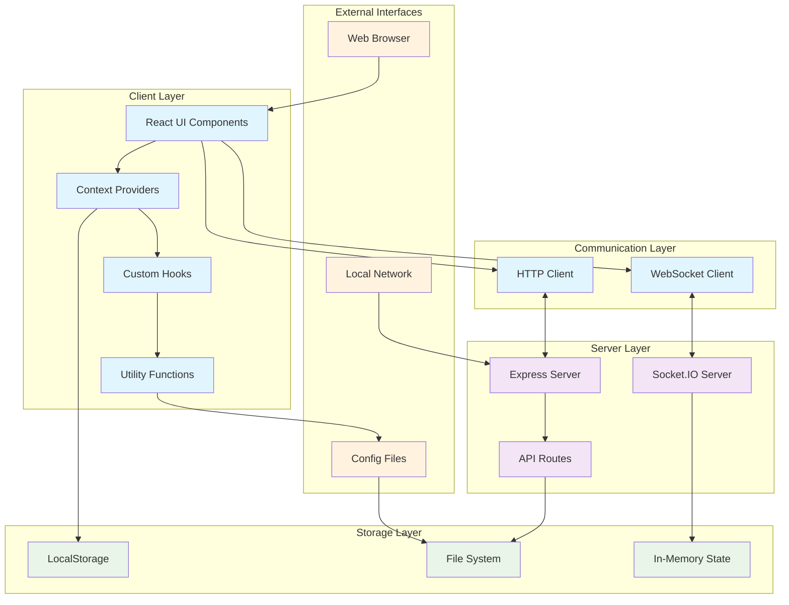

# Electric Maze - Technical Specification

## Table of Contents
1. [System Overview](#system-overview)
2. [Architecture Diagram](#architecture-diagram)
3. [Component Specifications](#component-specifications)
4. [Data Flow](#data-flow)
5. [Deployment Formats & Scenarios](#deployment-formats--scenarios)
6. [Security & Threat Model (STRIDE)](#security--threat-model-stride)
7. [Performance Requirements](#performance-requirements)
8. [Scalability Considerations](#scalability-considerations)

## System Overview

The Electric Maze is a real-time multiplayer team-building application designed for leadership exercises and collaborative problem-solving. The system enables teams to navigate through a virtual maze where they must discover the correct path while avoiding electric squares that reset their progress.

### Key Features
- **Real-time Multiplayer**: Multiple teams can play simultaneously with live updates
- **Relay Mode**: Team members take turns with click or time-based limits
- **Configuration Management**: Administrators can create, save, and load custom maze layouts
- **Answer Key Interface**: Administrative view showing complete maze solutions
- **Audio Feedback**: Sound effects and announcements for enhanced user experience
- **Network Sharing**: Local network deployment for team sessions

### Technology Stack
- **Frontend**: React 18 + TypeScript + Material-UI (MUI)
- **Backend**: Node.js + Express + Socket.IO
- **State Management**: React Context API
- **Storage**: LocalStorage + File-based configuration export/import
- **Real-time Communication**: WebSocket (Socket.IO)
- **Build Tool**: Vite
- **Audio**: Web Audio API

## Architecture Diagram



## Component Specifications

### Frontend Components

#### Core Components
- **MazeGrid**: Interactive 8x8 grid with keyboard navigation and click handlers
- **ControlPanel**: Administrative controls for game configuration and team management
- **AnswerKey**: Administrative view showing complete maze solution
- **MazeConfigs**: Configuration management interface for saving/loading maze layouts

#### Context Providers
- **MazeContext**: Global state management for grid, teams, relay mode, and game state
- **Socket Context**: WebSocket connection management and real-time updates

#### Custom Hooks
- **useSocket**: Socket.IO connection and event handling
- **useAnnouncer**: Audio announcements and accessibility features
- **useKeyboard**: Keyboard navigation and shortcuts

### Backend Components

#### Server Architecture
- **Express Server**: HTTP server for static file serving and API endpoints
- **Socket.IO Server**: Real-time WebSocket communication for multiplayer features
- **Route Handlers**: RESTful API endpoints for configuration management

#### Data Models
```typescript
interface MazeSquare {
  isPath: boolean;
  isRevealed: boolean;
  isActive: boolean;
  isElectric?: boolean;
}

interface TeamStats {
  explored: Set<string>;
  mistakes: number;
  startTime?: number;
  completionTime?: number;
}

interface StoredMazeConfig {
  name: string;
  grid: Array<Array<MazeSquare>>;
  createdAt: string;
}
```

## Data Flow

### Game State Synchronization
1. **Client Action**: User clicks maze square or uses keyboard navigation
2. **Context Update**: MazeContext updates local state
3. **Socket Emission**: Change broadcasted to Socket.IO server
4. **Server Broadcast**: Server relays update to all connected clients
5. **Client Reception**: Other clients receive and apply state changes

### Configuration Management
1. **Save Flow**: Grid state → LocalStorage → Optional file export
2. **Load Flow**: File import/LocalStorage → Context state → UI update
3. **Validation**: Configuration validation before application

### Relay Mode Flow
1. **Turn Management**: Timer/click tracking in MazeContext
2. **Turn Switching**: Automatic or manual player transitions
3. **State Persistence**: Turn state maintained across network updates

## Deployment Formats & Scenarios

### Format 1: Local Development
**Use Case**: Development and testing
```bash
npm run dev        # Frontend (Vite dev server)
npm run server     # Backend (Node.js server)
```
- **Ports**: Frontend (5173), Backend (3002)
- **Features**: Hot reload, debugging, full development tools

### Format 2: Local Network Deployment
**Use Case**: Team building sessions, workshops, training
```bash
npm run build      # Production build
npm run preview    # Serve production build
npm run server     # Backend server
```
- **Access**: `http://[hostname].local:3002` or `http://[IP]:3002`
- **Features**: Multi-device access, stable performance
- **Network Requirements**: All devices on same network/subnet

### Format 3: Containerized Deployment
**Use Case**: Consistent deployment across environments
```dockerfile
FROM node:18-alpine
WORKDIR /app
COPY package*.json ./
RUN npm ci --only=production
COPY . .
RUN npm run build
EXPOSE 3002
CMD ["npm", "run", "start"]
```
- **Benefits**: Environment consistency, easy scaling
- **Orchestration**: Docker Compose or Kubernetes

### Format 4: Cloud Deployment
**Use Case**: Remote teams, large-scale workshops
- **Platforms**: AWS, Azure, GCP, Heroku
- **Features**: Global accessibility, auto-scaling, managed infrastructure
- **Considerations**: WebSocket support, session persistence

### Scenario Matrix

| Scenario | Participants | Duration | Format | Network | Features |
|----------|-------------|----------|---------|---------|----------|
| Small Team Workshop | 5-15 people | 30-60 min | Local Network | WiFi/LAN | Basic gameplay, single facilitator |
| Leadership Training | 20-50 people | 1-2 hours | Local Network + Cloud | Hybrid | Multiple facilitators, advanced configs |
| Remote Team Building | 10-30 people | 45-90 min | Cloud | Internet | Screen sharing, virtual facilitation |
| Conference Demo | 100+ people | 15-30 min | Cloud + Local | Conference WiFi | High availability, quick setup |
| Educational Setting | 15-25 students | Class period | Local Network | School network | Curriculum integration, progress tracking |

## Security & Threat Model (STRIDE)

### Spoofing (Identity)
**Threats:**
- Impersonation of team members or administrators
- Fake client connections to manipulate game state

**Mitigations:**
- Session-based player identification
- IP-based connection tracking
- Administrative access controls for configuration mode

### Tampering (Data Integrity)
**Threats:**
- Malicious modification of maze configurations
- Client-side manipulation of game state
- Injection of invalid grid data

**Mitigations:**
- Server-side validation of all state changes
- Configuration file integrity checks
- Input sanitization and type validation
- Read-only mode for non-administrative users

### Repudiation (Non-repudiation)
**Threats:**
- Denial of actions taken during gameplay
- Disputed game results or configurations

**Mitigations:**
- Action logging with timestamps
- Immutable game history tracking
- Configuration change audit trail

### Information Disclosure (Confidentiality)
**Threats:**
- Unauthorized access to maze solutions
- Exposure of team strategies or progress
- Leakage of configuration data

**Mitigations:**
- Answer key restricted to administrative interface
- Team isolation in multiplayer scenarios
- Secure configuration storage and transmission

### Denial of Service (Availability)
**Threats:**
- WebSocket connection flooding
- Resource exhaustion through rapid requests
- Network congestion affecting real-time updates

**Mitigations:**
- Connection rate limiting
- Resource usage monitoring
- Graceful degradation for network issues
- Client-side state persistence during disconnections

### Elevation of Privilege (Authorization)
**Threats:**
- Unauthorized access to configuration mode
- Administrative function abuse
- Privilege escalation through client manipulation

**Mitigations:**
- Role-based access control
- Administrative mode toggle restrictions
- Server-side permission validation
- Secure administrative interface separation

### Risk Assessment Matrix

| Threat Category | Likelihood | Impact | Risk Level | Priority |
|----------------|------------|---------|------------|----------|
| Spoofing | Medium | Low | Medium | 3 |
| Tampering | High | Medium | High | 1 |
| Repudiation | Low | Low | Low | 5 |
| Information Disclosure | Medium | Medium | Medium | 2 |
| Denial of Service | Medium | High | High | 1 |
| Elevation of Privilege | Low | High | Medium | 4 |

## Performance Requirements

### Response Time Targets
- **UI Interactions**: < 100ms for local state updates
- **Network Updates**: < 500ms for real-time synchronization
- **Configuration Loading**: < 2s for maze configuration changes
- **Initial Load**: < 5s for application startup

### Throughput Requirements
- **Concurrent Users**: Support 50+ simultaneous players
- **WebSocket Messages**: Handle 100+ messages/second
- **Configuration Operations**: Process 10+ config changes/minute

### Resource Constraints
- **Memory Usage**: < 100MB per client session
- **Network Bandwidth**: < 1MB/minute per active session
- **Storage**: < 10MB for configuration data

## Scalability Considerations

### Horizontal Scaling
- **Load Balancing**: Multiple server instances behind load balancer
- **Session Affinity**: Sticky sessions for WebSocket connections
- **Database Scaling**: Distributed configuration storage

### Vertical Scaling
- **Memory Optimization**: Efficient state management and garbage collection
- **CPU Optimization**: Optimized algorithms for pathfinding and validation
- **Network Optimization**: Message compression and batching

### Caching Strategies
- **Client-Side**: LocalStorage for configurations and user preferences
- **Server-Side**: In-memory caching for frequently accessed configurations
- **CDN**: Static asset distribution for global deployment

### Monitoring & Observability
- **Metrics**: Response times, error rates, concurrent connections
- **Logging**: Structured logging for debugging and audit trails
- **Alerting**: Automated alerts for performance degradation
- **Health Checks**: Endpoint monitoring for service availability
